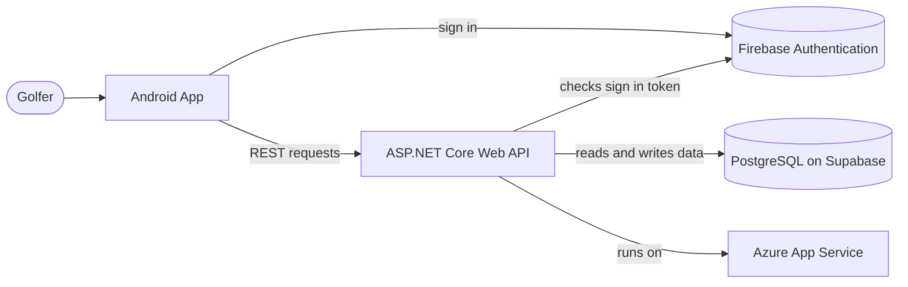

# TeeUp

TeeUp is an Android app for golfers. It helps you book a tee time, find other
players to join you when you do not have a full group, and keep score during
your round.

## Table of Contents

- [About the App](#about-the-app)
- [Features](#features)
- [Screenshots](#screenshots)
- [Architecture](#architecture)
- [Tech Stack](#tech-stack)
- [Project Structure](#project-structure)
- [Getting Started](#getting-started)
- [Version Control Workflow](#version-control-workflow)
- [Continuous Integration](#continuous-integration)
- [Demo Video](#demo-video)
- [Team](#team)

## About the App

Booking a golf round is easy on its own, but most apps stop there. If you do
not have three friends free that day, you are stuck. TeeUp solves this by
letting golfers open up their booked tee time to other players looking for a
game, based on things like handicap range and pace of play. Once the round is
done, players can enter their scores hole by hole and see stats like total
strokes, total putts, and a net score worked out from their handicap.

The app is built around three ideas that, together, are not offered by any
single existing golf app:

- Booking a real tee time at a course.
- Matching with golfers you do not already know, based on shared preferences.
- Scoring a round and keeping a history of past rounds.

This project is being built as part of the Programming 3D (PROG7314) Portfolio
of Evidence at The Independent Institute of Education. It is a group project
built by three students.

## Features

### Available now (Prototype)

- Register and sign in using Google Single Sign-On, or with an email address
  and password.
- Biometric sign-in (fingerprint or face unlock) after your first sign-in.
- Browse tee times and courses, book a tee time, and create a group that is
  looking for more players.
- Send, accept, decline, and withdraw requests to join a group.
- Score a round hole by hole, with the option to go back and fix a hole.
- View round summaries after finishing: total strokes, total putts, average
  putts per hole, net score, and Stableford points, all worked out from the
  player's own handicap.
- Edit personal details, playing details (handicap, home course, pace of
  play), and notification preferences.
- In-app notifications for things like an accepted join request or a
  cancelled tee time.
- Support for three languages: English, Afrikaans, and isiXhosa.
- Automated build and test checks that run on every push to GitHub.

### Planned for the final submission

- Offline mode, so some actions can be done without an internet connection
  and will sync automatically once the connection comes back.
- Real-time push notifications using Firebase Cloud Messaging.
- Final production icons and images, and Google Play Store preparation.

## Screenshots

Screenshots of the app will be added here once the current round of features
is finished.

## Architecture

The app is split into two parts that live in this same repository: the
Android client and the backend API. The Android app never talks to the
database directly. Every piece of data goes through the API.



A short explanation of each part:

- **Android app**: Written in Kotlin, using plain Android views (no Jetpack
  Compose). It shows the screens, collects user input, and calls the API for
  anything that needs to be saved or looked up.
- **Firebase Authentication**: Handles sign-in. The Android app signs the
  user in and gets back a token. That token is sent to the API with every
  request so the API knows who is asking.
- **ASP.NET Core Web API**: The backend. It checks that each request has a
  valid sign-in token, then handles the actual business logic, such as
  booking a tee time or working out round stats. It is organised into
  controllers, services, and repositories, so each layer has one clear job.
- **PostgreSQL database**: Where all the app's data is stored (users, tee
  times, join requests, rounds, and so on), accessed through Entity
  Framework Core. The database is hosted on Supabase.
- **Azure App Service**: Where the API is hosted, so the app works from any
  device, not just on one computer.

## Tech Stack

| Layer | Technology |
|---|---|
| Mobile app | Kotlin, native Android views |
| Authentication | Firebase Authentication (Google Sign-In and email/password), biometric unlock |
| Backend API | ASP.NET Core Web API (.NET 10) |
| Database | PostgreSQL, hosted on Supabase, accessed with Entity Framework Core |
| Hosting | Azure App Service |
| Automated testing | JUnit (Android), xUnit (API) |
| Continuous integration | GitHub Actions |

## Project Structure

```
android/   Kotlin Android client
api/       ASP.NET Core Web API (controllers, services, repositories) and Entity Framework Core
infra/     Scripts and notes for setting up the database in the cloud
```

Each of the `android` and `api` folders has its own README with more detail
on how to set it up and run it.

## Getting Started

To run the project locally, you will need:

- Android Studio, with JDK 17 and Android SDK 34 installed.
- The .NET 10 SDK.
- A PostgreSQL database (for local development) or access to the shared
  Supabase database.

Steps:

1. Clone this repository.
2. Set up and run the API first. See `api/README.md` for the exact steps,
   including how to set your local database connection string.
3. Open the `android` folder in Android Studio and run the app on an
   emulator or a physical device. See `android/README.md` for details.

## Version Control Workflow

Every piece of work is tracked as a ticket in our project management tool,
and each ticket gets its own branch, named after the ticket, for example
`brandon/eme-306-prototype-readmemd-architecture-purpose-cicd-summary`. This
makes it clear which piece of work each branch and commit belongs to.

Once a piece of work is ready, it is opened as a pull request into `main` so
a teammate can review it before it gets merged in. This keeps `main` in a
working state at all times and gives every change a second pair of eyes
before it goes in.

## Continuous Integration

This project uses GitHub Actions to automatically build and test the code
every time someone pushes to the repository. There are two separate
workflows, one for each part of the project, so a change to the Android app
does not need to wait on the API to build, and the other way around.

- **Android CI** (`.github/workflows/android-ci.yml`): Builds the Android
  app and runs its unit tests.
- **API CI** (`.github/workflows/api-ci.yml`): Builds the API and runs its
  unit tests.

Both workflows run on every push and every pull request that touches their
part of the project. If a build or a test fails, it shows up directly on the
pull request, so problems get caught before they reach `main`.

## Demo Video

The demonstration video will be linked here once it has been recorded.

## Team

This project is built by a group of three students as part of the Emeris
team:

- Brandon van der Walt
- Matt Klette
- Braeden Naidoo
